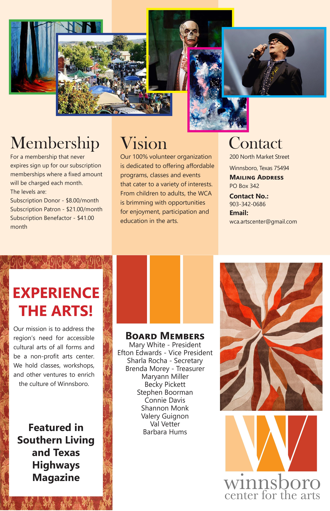

# Work samples  

## Heuristic Analysis of Denton Public Library Catalog
I had run a [heuristic analysis](https://www.interaction-design.org/literature/topics/heuristic-evaluation) of the [Denton Public Library](https://library.cityofdenton.com/) Catalog for my Usability and User Experience class during my Master's degree which I then updated for submission for my graduate school portfolio.  
*Tools used: Microsoft Word, heuristic analysis questionnaire created by our professors*    
[Heuristic Analysis](heuristic_analysis.pdf)  

## How-to guide: Downloading torrents
I had created this how-to guide to explain downloading torrents to any audience. This was a part of my final portfolio submission for graduation from my Master's.  
*Tools used: Adobe Indesign, Adobe Photoshop*  
[How-to guide: Downloading torrents](procedural_document.pdf)

## Winnsboro Brochure  
Our class needed to create a brochure and my friend Molly said her hometown needed an overhaul of their marketing material. This brochure went through multiple iterations before my portfolio committee was satisfied with the final design.  
*Tools used: Adobe Indesign, Adobe Photoshop*  

